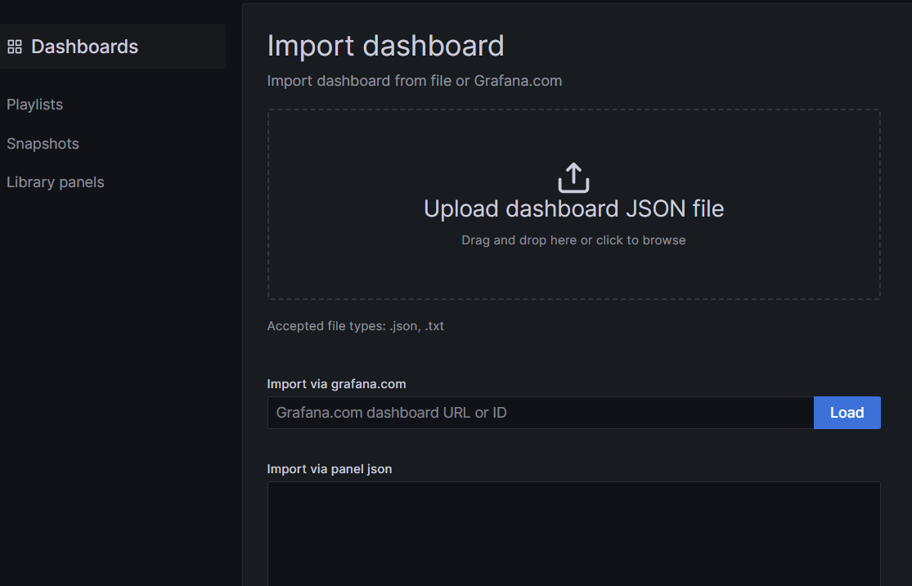

# Dashboards de Grafana

El sitio de Grafana aloja una gran cantidad de tableros mantenidos por la comunidad de Grafana, los cuáles también utilizamos cómo base de los tableros que utilizamos. Para conocer más acerca de los dashboards de Grafana acceda al sitio oficial de los dashboards de Grafana [Dashboards de Grafana](https://grafana.com/grafana/dashboards/)

Este repositorio contiene Dashboards de Grafana inspirados en los dashboards creados por la comunidad de Grafana o Dashboards creados a medida por nuestro equipo.

## Categorías
Los dashboards está separados por categorías, las cuáles iremos actualizando a medida que se vayan modificando/creando nuevos dashboards. Actualmente tenemos las siguientes categorías:

| Categoría     | Descripción                                                      |
| ------------- | ---------------------------------------------------------------- |
| Networking    | Dispositivos de red cómo Routers, Switches, APs, Firewalls, etc. |
| Servidores    | Servidores con Sistema Operativo Linux o Windows                 |
| Base de datos | Motores de base de datos                                         |

## Cómo utilizar los dashboards de este repositorio
**Para utilizar un dashboard realice los siguientes pasos**
> ⚠️    **Estos dashboards fueron probados en Grafana 9.3.x y superior**  
> ⚠️    **Estos tableros pueden ser utilizados en instancias de Grafana distintas a las mantenidas por Conectate, en este caso la URL https://customer.conectate.io/dashboard/import debe coincidir con la URL de acceso utilizada por su instancia de Grafana**

1. Identificar la categoría de Dashboard que estamos necesitando, por ejemplo para un dispositivo Fortinet:  

   - Seleccionamos la categoría  **Networking**
   - Seleccionamos y descargamos el dashboard **Fortigate Prometheus Exporter Conectate.json**
   - Accedemos a la URL:  
     https://customer.conectate.io/dashboard/import dónde **customer** debe coincidir con el ID de su cuenta en el servicio ofrecido por Conectate 

   - Hacer click en el botón **Upload dashboard JSON file** 
     
     
   - Seleccionar el archivo JSON descargado anteriormente.

   - Definir el nombre, ubicación del dashboard y UID del dashboard
        > Normalmente no es necesario modificar  parámetros, salvo que querramos customizar el nombre o la carpeta que almacena el dashboard.

   - Apretamos el botón **Import** para finalizar la importación

   - Si los pasos fueron realizados de forma correcta, podemos comenzar a utilizar el dashboard.
